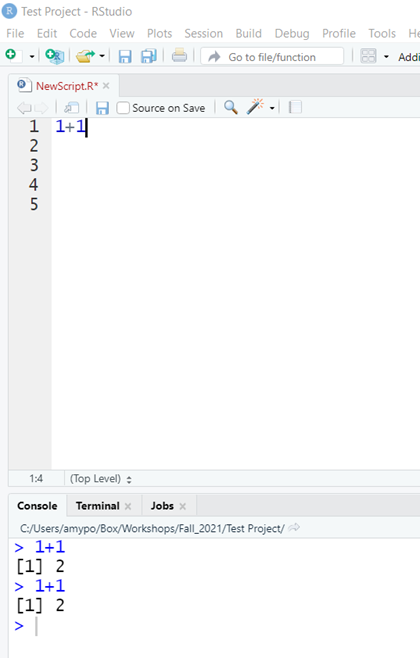

```{r setup, include=FALSE}
knitr::opts_chunk$set(echo = TRUE)
```

# Basic Mathematical Operations
R can do basic math operations.  
Type 1+1 on the first line of your R script file.  
What happens?  

NOTHING!  
That's because at this point, all you have done is told the computer that you are **GOING** to ask it to complete 1+1, but you haven't asked it to actually **DO** the operation yet.  

Let's tell it to complete this operation.  This can be done using a button in R, or using a keyboard shortcut.  
You can highlight the line of code you want executed, and click  at the top right of the Rscript panel, or you can put your cursor anywhere on that line of code and hit `ctrl` and `enter`  

Try this (you can try it both ways)...  Now what happens?  

Notice that the answer does not appear in your R script, it appears down in the console.  
  
This is one difference between an R script and and R markdown.  R markdown (as we will see later) will show the response of running the code in the R markdown document.

#### R can do all of the basic math operations.
  

Try using some different operations.  
Remember that if you have more than one line of code, you will need to highlight it before telling the computer to run if you want it to run multiple lines.  

R understands the basic order of operations.  
Try computing 20 * 4 + 1.  
Now try computing 20 * (4 + 1).  
Determine if 8112021 is divisible by 3. Hint use the `%%` operator (it's the % twice).   
what about 8162021?   
Trig functions also work.   
Try cos(0).  

# Assigning Variables
You can assign values to objects with `<-`, the assignment operator.  
The keyboard shortcut for this (because no one wants to actually type the < and - keys) is...  
*For Windows users: `alt` + `-`  
*For Mac users: `cmd` + `-`   
*As a side note, for Windows users if you mistakenly hit `ctrl` + `-` it will shrink the size of your font. (This is very annoying!)  To increase it again, use `ctrl` + `shift` + `=`  (aka `ctrl` + `+`).  
Try this code:
```{r}
x <- 10
x + 5
```
After running this code, you will notice that there is now something in the **Environment** tab in the upper right corner of your screen - it shows that you have assigned the value of 10 to the variable x.

You can also perform operations on variables.
```{r}
y <- 20
x+y
```
```{r}
x-y
```
```{r}
y %% x
```

# Using Functions
Every programming language uses functions.  in R, they typically look something like:  
function_name(arg_1= ..., arg_2= ....)  

As an example, the `seq` function requires 3 arguments.  It takes a starting number, an ending number, and an interval, and returns a sequence of numbers based on those inputs.
```{r}
#seq(arg_1=starting number, arg_2=ending number, arg_3=interval)
# So if you would like to count from 1 to 20 by 2s, you would type:
seq(1,20,2)
```
Note that since I told it to start at 1, it reports all the odd numbers.  If I had told it to start at 0, we would have gotten the even numbers.
```{r}
seq(0,20,2)
```
Just like we assigned numeric values to variables, we can assign the output of functions to variables as well.
```{r}
a <- seq(0,20,2)
```
Note that when we run this code, our console just shows the function, it doesn't report the output.  But we see that we have a new variable,`a` in our environment list.  
To look at the output of this function, we now need to call the variable that we have it assigned to. Essentially this can be done by telling it to `print` the variable.  In R, you can either use the command `print(a)` or just type `a`.  Both will give the same result.
```{r}
a
print(a)
```
Just like with our other variables, we can do other stuff to this variable.  For example;
```{r}
a+2
```
We've now added 2 to each of the elements in our list of numbers.  
try calling `a` again and see what you get.
```{r eval=FALSE}
a
```
Did performing the operation on it change the numbers stored in a?

If you wanted to store the new output, you would need to assign it to a new (or the same) variable.
```{r}
b <- a+2
```
a = `r a`  
b = `r b`
```{r}
b <- b+2
```
Now, b = `r b` 

Another function that can be useful with lists of numbers is `length`.
```{r}
length(a)
```
This returns the number of elements that are in our object.  This can be useful when determining why code doesn't work.
```{r}
c <- seq(0,12,1)
a + c
```
In this case, we got an error, but R then tried to go ahead and execute what we asked and gave us an answer.  But what it did it do?  
a  = `r a`  
c  = `r c`  
 


Numbers are not the only things that can be assigned to variables.  
Characters can also be assigned to variables:
```{r}
d <- "I Love"
e <- "dogs"
```

What happens if we do `d + e`?

We get an error because the computer doesn't know how to perform addition on two sets of letters (neither do I, for that matter!).  
What if we want to write the sentence "I Love dogs" using our variables?
```{r eval=FALSE}
d e
```
We get an error!

What about
```{r eval=FALSE}
d
e
```
This is closer to what we want.  But how do we get it on one line?

We use another function - `paste`
```{r}
paste(d,e)
```

Ahhh!  Success!  

Remember the quote from the first page: You have not failed, you've just found 10,000 ways that won't work!

# Data Structure and Objects

Programming languages often refer to different types of data structures or Objects (in Java).  
Some of the common types of data structures in R are: Vectors, Lists, Matrices, Arrays, Factors, and Data frames.

## Vectors
Vectors are the simplest data structure in R.  They are defined as "a single entity consisting of a collection of things."  Basically they are a list of "things".  
"Things" can be numbers, letters, words, etc.  
The simplest way to create a vector is using the `c()` command (Concatenate - Link things together in a chain or a series).  
```{r}
v <- c(1,2,3,4)
v
```
Our lists of numbers that we created earlier using the `seq` command are vectors.  

The command `typeof()` can be used to determine what type of vector an object is.
```{r}
m <- c(1,2,3,4,5)
n <- seq(1,10)
g <- c("Hi", "Hello", "Aloha", "What's up", "Hey", "Hola")
l <- c(TRUE, FALSE, T, F, T, T, F, F)
typeof(m)
typeof(n)
typeof(g)
typeof(l)
```
m: `r m` is a "`r typeof(m)`" vector. It consists of floating point numbers.  
n: `r n` is a "`r typeof(n)`" vector. It consists of integers (no decimels).  
g: `r g` is a "`r typeof(g)`" vector. It consists of letters (in this case words consisting of letters).  
l: `r l` is a "`r typeof(l)`" vector. It consists of a collection of True or False statements. Note that logical data types in R are case sensitive. TRUE, FALSE, T, and F are all valid logical data types. True and False, as well as true and false, and t and f are not logical data types.  

Just because you see a number, do not assume that it is a numerical (floating point or integer) data type.

Try this:
```{r}
nu <- "8"
nu
```

What do you think `typeof(nu)` would return?
```{r}
typeof(nu)
```

Why is not "double" or "integer"?

The `c()` command can also be used to add "things" to an existing vector:
```{r}
m <- c(m, 6,7,8,9,10)
m
```

Notice how here I did not have to create a different name for the longer vector.  It just replaced the old one. This is something to keep in mind. R will not prompt you that it is "replacing" your old data structure (like Windows does if you try to save a file with the same name as an existing one), it just does it.  

This is a good time to talk about how to handle data.  With your actual data, the original data should be treated as READ ONLY. Thus, you never use the same name as the data when you are changing something in the data.  The first time it is imported and something is changed, you always want to assign it a new name.  

You can also include a command inside the `c()` command:
```{r}
n <- c(n, seq(11,20))
n
```
## Matrices

In R, a matrix is a collection of elements of **the same data type** arranged into a fixed number of rows and columns.  You can create a matrix using the `matrix()` function.  The function takes a list of the elements you want in the matrix, whether you want it to fill across the row first or down a column first, and the number of rows you want it to have.
```{r}
mat <- matrix(1:12, byrow=TRUE, nrow=3)
mat
```
Compare this with the following example:
```{r}
mat2 <- matrix(1:12, byrow=FALSE, nrow=3)
mat2
```
What do you think will happen if we give the following command:
```{r eval=FALSE}
matrix(1:12, byrow=TRUE, nrow=5, ncol = 4)
```
Let's see:
```{r}
matrix(1:12, byrow=TRUE, nrow=5, ncol=4)
```
Another example where R will try to do what you ask, even if it might not really be what you want!

## Arrays
Where matrices are two-dimensional, arrays are 3-dimensional. Matrices can be thought of as (row * column). Arrays can be thought of as (row * column * height). Another way to think of it is an array is like a stack of matrices. Similar to matrices, arrays must contain the same data types. Arrays are not used as often as other data structures.
```{r}
# Here we are going to create 2 vectors and use them to create an array
vector1 <- seq(5,20,5)
vector2 <- seq(25,60,5)
vector1
vector2
# Now we will create the array
ArrayEx <- array(c(vector1,vector2), dim=c(4,4,3))
ArrayEx
```
As you can see, we now have 3 matrices, each containing 4 rows and 4 columns created from the values in the two vectors. This is an array that is 3 dimension (rows = 4, columns = 4, height=3).  
I personally do not use the array data type all that often when working in R.  

## Lists
Vectors, Matrices, and Arrays are all composed of elements that are the same data type (charcter, numerical, or logical).  
Lists differ from these data structures because they can be comprised of elements of different data types. In fact, a list can be comprised of a group of lists.
```{r}
li <- list(TRUE, "Hello", 28, '8', 31.2, F)
li
```
You'll notice that when you ask R to print the list, it prints a little differently than a vector would.  
You can use the `length` command to determine the number of elements in the list.
```{r}
length(li)
```
### Accessing specific elements in a list, vector, matrix, or array
What if you want to know what the 3rd element of a data structure is, but don't want to print the entire data object (for example, a dataset I'm currently working with has over 500,000 participants - aka 500,000 ROWS of Data - Believe me, I don't EVER want to print that!).  RNA seq data can have far more entries than this.  
We can use brackets to specify a specific element in data structure.
```{r}
li[3]
```
Thinking back to our matrix from earlier, now we need to specify a 2 dimensional direction to a element. R stores this information in the form of (row,column) or in the case of an array (row, column, height).
```{r}
mat[1,3] #This will specify the first row and third column of our matrix, "mat"
ArrayEx[2,3,3] #This will specify the 2nd row, third column of the 3rd matrix in our Array, "ArrayEx"
```
Brackets can be used in conjunction with other commands, such as `typeof`:
```{r}
typeof(mat[2,4])
```
Of course, since our matrix has to all be the same data type, we really only need to do this for 1 element. This is true for vectors and arrays as well.
```{r}
typeof(ArrayEx[4,2,1])
```
What is the type of the fourth object in our list, "li"?
```{r}
typeof(li[4])
```
Was this the result you expected?  
R actually sees `li` as a collection of lists, each list containing only 1 object.  So instead of returning "Character" (as we would expect), it returns "list".  
Try the following:
```{r eval=FALSE}
typeof(li[[4]])
```
Now do you get the result you expected the first time?  
Essentially the double brackets `[[]]` is telling R to look at the object in the 4th list of li.  
While this seems trivial in our very simple examples, knowing this information can be really helpful when you are working with data and a command does not do what you expect it to!  

## Data Frames
This is probably the most used data structure in R. Especially if you are using R for statistical computing or making graphs.  You can think of a data frame as a list of vectors of equal length, where each vector can be of a different data type. This is overly simplistic, but I think of data frames as an excel worksheet.  

You can create a data frame using the `data.frame` function:
```{r}
animal <- c("cat", "zebra", "turtle", "chicken")
legs <- c(4,4,4,2)
mammal <- c(T,T,F,F)
zoo <- data.frame(animal, legs, mammal)
zoo
```
You can add a column to a data frame by using the `$` after the name of the data frame and telling R what values to include.
```{r}
zoo$canFly <- c(F,F,F,T)
zoo
```
What if I want to add another row to my data frame?  Let's say I want to add information for a pig.  
This can actually be done in 1 of two ways, both work equally well, it's a matter of your personal choice as to which one you do.  
Both ways require us to create a new list for our new row.
```{r}
newanimal <- c("pig",4,T,F)
```

Technique 1: Use `rbind` to add the row to the data frame.  
```{r}
zoo1 <- rbind(zoo, newanimal)
#rbind takes arguments of the original df and the list you want to add.
zoo1
```
Technique 2: Use the number of rows to add the row to your data frame.  For this you use the `nrow` (number of row) command and add 1 to it to let R know you are adding a row.
```{r}
zoo2 <- zoo #replicate dataframe
zoo2[nrow(zoo2)+1,] <- newanimal # Tell R to add a new row to the data frame.
zoo2
```

We could have actually done this without replicating the data, but it is generally not a good idea to edit your original data in R. If this was a dataframe that we had already created from our original data (thus changing it would not affect the original data), we could have done this:
```{r}
zoo[nrow(zoo)+1,] <- newanimal
zoo
```

Notice how in this second technique, we are essentially using the brackets to specify a location in the dataframe.  We are saying go to 1 past the current last row, and by putting nothing after the `,` we are saying we want to specify all columns in that row.  

We can also use this type of convention for examining the data, for example, if we want to see all the data for 1 specific row:
```{r}
zoo[4,]
```
### Congratulations!  You have completed the R basics section of this course.  Next up, we will start looking at a dataset and using R markdown instead of R script.