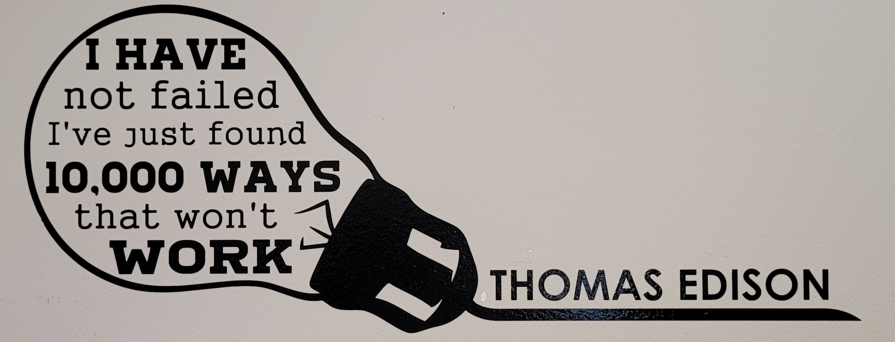

```{r setup, include=FALSE}
knitr::opts_chunk$set(echo = TRUE)
```
# Fall 2021 BCB Orientation Workshops: Basic R
### Amy Pollpeter, PhD Student - Willette Lab
### Welcome Everyone!
## Download
### If you haven't already done so, please make sure you have downloaded R and R-Studio You can download them from [HERE](https://mirror.las.iastate.edu/CRAN/)


## What is R?
### * Language and environment for __Statisitcal Computing__ and __Graphics__.
### * Provides a wide variety of statistical and machine learning methods.
### * Can be used to explore and understand data in an open-ended, interactive way.
### * Free software that can be run on a wide variety of platforms (Windows, Mac, Unix/Linux).
From r-project.org

## Why I Use R?
### Admittedly, if you are not familiar with programming, R (like many languages) can have a steep learning curve!
#### When I first started using it (2 years ago) I HATED IT!
#### But... ___I persevered___.  And grew to use it more than any other program.
### It is incredibly versatile due to the large community of R users.
### Thus, if there is something you want to do, there is probably an R package to do it (we'll discuss packages more in a minute).
### There is also a lot of documentation, tutorials, and cheat sheets online (use them!)  I'll have links to a few of these later.  Google will become your best friend when using R.

### This quote is now on my wall at home behind where I work.  I often spin my chair around and stare at it.  When writing computer code - it is incredibly relevant!  
  

### Let's get started!


