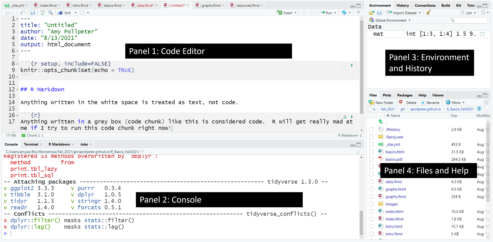

```{r setup, include=FALSE}
knitr::opts_chunk$set(echo = TRUE)
```

# Introduction to the R Studio Environment
### Meet R Studio

### FYI: you may not have panel 1 at this point, and panel 2 will be taking up the entire left side of your screen.  That's OK.  Once we get to opening a file, it'll look like this!

### Panel 1
This is where the bulk of your coding will be done.

### Panel 2
4 tabs are present in this panel:  
__Console, Terminal, R Markdown, Jobs__  
Most of the time, you'll be in the __Console__ tab.  
The __Terminal__ tab is basically your typical unix terminal (this can sometimes be useful for using git - we won't be using it today).  
__R Markdown:__ I'll touch on this later.  
__Jobs:__ Honestly, I've never used this tab - therefore, it's beyond the scope of Basic R.

### Panel 3: Environment/History
I usually have this one set as Environment.  As we assign variables, or create data frames and other R classes, they will show up in this list.  Can be very useful.  If you have a dataframe in this list, can click on it to view that dataframe (we'll discuss this more later).

### Panel 4: Files, Plots, and Help
If the __File__ tab is active, this will list all the files in your current working directory.  
If you create a plot in a script, it will show up here in the __Plots__ tab.  
If the __Packages__ tab is active, it will show all your available packages (we'll discuss these in a mooment too).  
If __Help__ tab is active, it will show help topics.  

# File Types
### R Studio supports several file types. 
  

We will mainly be using R markdown.  
Another common file type is R script.  This opens up a basic empty script file.  I'll try to touch on differences between these as we go on.

### Why I use R Markdown instead of R scripts
* I like the ability to convert it all to a PDF or Html document that can be sent to my PI to show them the progress on my work.
* I find the ability to split up my code into separate chunks (more on this later) to be very helpful in organizing my code.  If I need to make a change, it is easy to just run that specific chunk than have to highlight it and everything below it.
* Honestly, I first learned R in R markdown!
* This website was created using R markdown.

## Our First File
#### Let's create our first R file.
We are going to start this by creating a new project.  I find it helpful to create my files within projects.  I include each project in it's own folder so it is easier to manage them.  
* Having a separate folder for your project can become essential.  A current data analysis research project I have been working on has over 5,000 files in it at the moment.  That is just the files being used for the R programming in the project.  I have about 30 different R markdown files (I tend to separate different parts of the analysis) plus numerous output files such as graphs that I use as figures.

### Create an R project
Go to **File** --> **New Project**  
You should see the following window:  
  
Click on **Existing Directory** (second choice)
This will open up a window where you can click **Browse** to navigate to a specific folder you would like to store your project in.  I suggest having a folder for this workshop and within it create a folder titled R Project 1 or something similar.

You will notice in the **Files** tab (bottom right), it will now show your Project name:  
  

### Now, let's create our first file
* For this first file, we will use an R script so you can get the feel of it versus the R markdown which we will use a little later.  
* Click on **File** --> **New File**  
* In the resulting list of Filetypes that we saw earlier, select **R script**
* Your R environment should now look like this:  
  
With a blank file type in the upper left, the console in the lower left, an empty environment in the upper right, and the files tab in the lower left.
* Note, that there is no file listed for your new script.  That's because it is not yet saved!  Let's save it and name it something so that we don't lose it if something happens.
* Saving files in R is pretty similar to saving them in any other windows application like Word, Excel, etc.
* **File** --> **Save As**
The only difference is that if you have multiple files open and you have made changes in several of them, there is an option to click **Save All** and it will save all of the files that have new changes.
* Notice that there is now a file listed in your files tab in addition to your R project.  The file should have the extension .R.  This indicates it is an R script.  You will see later that our R markdowns files will have .Rmd as an extension.
  

### Now we will move on to some basic R commands and capabilities.


